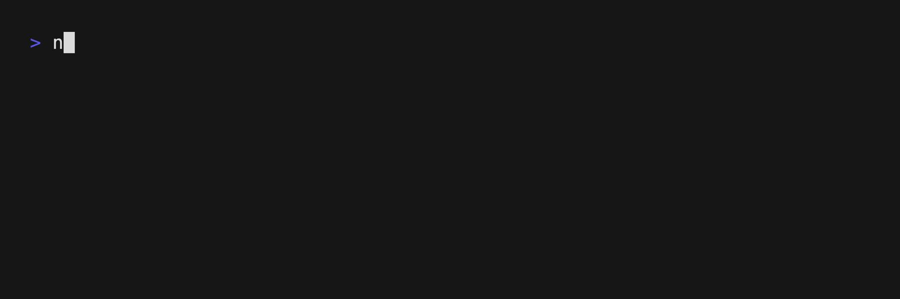

# Nodestream 0.12 Release

We are happy to announce the release of Nodestream 0.12. 
This release marks the largest update to Nodestream since its inception. 
We've spent a lot of time improving the core of nodestream and we're excited to share it with you.

Before we get into the details, we want to thank the community for their support and feedback. 
As such, we have completely revamped the documentation to make it easier to use and navigate.
This releases comes with two headline features [Database Migrations](#database-migrations) and [Multi-Database Support](#multi-database-support).

## Major Features

### Database Migrations 

In the past, nodestream attempted to automatically create indexes and constraints on the database based on your pipeline at runtime.
This was done by introspecting the schema of the entire project and generating the appropriate queries to create the indexes and constraints.
This was a very powerful feature but it had a few drawbacks:
- **It was redundant.** The same indexes and constraints were being created with `IF NOT EXISTS` clauses every time the pipeline was run.
- **It was slow.** The queries were being executed serially and the pipeline was locked until they were all completed.
- **It was error prone.** If the database was not in a state that allowed for the creation of the indexes and constraints, the pipeline would fail.
- **It was high friction.** There was no way to refactor the database without manual intervention. If the schema changed, the pipeline would fail and the user would have to manually remove the indexes, constraints, and sometimes data before running the pipeline again.

To address these issues, `nodestream` 0.12 has introduced the concept of migrations.
Migrations are a way of encapsulating changes to the database schema in a way that can be applied incrementally. 
Conceptually, they are similar to the migrations in the [Django](https://docs.djangoproject.com/en/5.0/topics/migrations/), [Rails](https://guides.rubyonrails.org/v3.2/migrations.html), [Neo4j Migrations](https://neo4j.com/labs/neo4j-migrations/2.0/), and [Flyway](https://documentation.red-gate.com/fd/migrations-184127470.html) frameworks.



Migrations are defined in a directory called `migrations` in the root of your project.
Each migration is a yaml file that contains data about the migration and its dependencies.
You can create migrations by running the `nodestream migrations make` command.

Check out the changes to the tutorial on [Database Migrations](/docs/docs/tutorial-basics/prepare-your-database) as well as the new tutorial on [Working With Migrations](/docs/docs/tutorials-intermediate/working-with-migrations) to learn more.

Core Contributors to this feature include:
- [Zach Probst](https://github.com/zprobst)
- [Grant Hoffman](https://github.com/grantleehoffman)
- [Yason Khaburzaniya](https://github.com/yasonk)
- [Chad Cloes](https://github.com/ccloes)
- [Angelo Santos](https://github.com/angelosantos4)

### Multi-Database Support 

Prior to this release, the only database that was supported was neo4j. 
While this is a category leading database, the goal of nodestream is to be database agnostic and afford developer the ability to use the database or _databases_ that best fits their needs. 
As such, we are happy to announce that nodestream now supports [Amazon Neptune](https://aws.amazon.com/neptune/) and [Amazon Neptune Analytics](https://docs.aws.amazon.com/neptune-analytics/latest/userguide/what-is-neptune-analytics.html).
TO accommodate that, we have moved the neo4j database connector into a separate package called [nodestream-plugin-neo4j](https://pypi.org/project/nodestream-plugin-neo4j/) and added a new package called [nodestream-plugin-neptune](https://pypi.org/project/nodestream-plugin-neptune/).

Starting with this release, you use the `--database` flag to generate neptune boilerplate configuration. 


**Check out the docs on it [here](/docs/docs/databases/neptune/)**.

Core Contributors to this feature include:
- [Zach Probst](https://github.com/zprobst)
- [Alex Le](https://github.com/aryex)
- [Cole Greer](https://github.com/Cole-Greer)
- [Dave Bechberger](https://github.com/bechbd)
- [Alexey Temnikov](https://github.com/alexey-temnikov)
- [Yang Xia](https://github.com/xiazcy)

## Other Features

### Parquet Support

Many customers have data stored in parquet format. 
Parquet is a columnar storage format that is optimized for reading and writing large datasets.
We are happy to announce that nodestream now supports parquet as a first class citizen.

**Check out the docs on it [here](/docs/docs/reference/extractors/#the-file-extractor-family)**.

Core Contributors to this feature include:
- [Zach Probst](https://github.com/zprobst)
- [Dave Bechberger](https://github.com/bechbd)
- [Cole Greer](https://github.com/Cole-Greer)
- [Leszek Kurzyna](https://github.com/leszek-bq)

### Include Properties From Maps

In the past, each property you wanted to include in the pipeline had to be explicitly defined in the pipeline configuration. 
This was a bit cumbersome and error prone.
Starting with this release, you can now include all properties by defining an expression that returns a map at the `properties` key directly instead of a mapping of property names to expressions.

For example, here are two examples on the `properties` and `source_node` interpretations:

```yaml
- type: source_node
  node_type: User
  key:
    email: !jmespath email
  properties: !jmespath path.to.properties.mapping
  normalization:
    do_trim_whitespace: true
```

```yaml
- type: properties
  properties: !jmespath path.to.properties.mapping
  normalization:
    do_lowercase_strings: true
```

**Check out the docs on it [here](/docs/docs/reference/interpreting)**.

Core Contributors to this feature include:
- [Zach Probst](https://github.com/zprobst)
- [Dave Bechberger](https://github.com/bechbd)

### Performance Improvements

We've made a small number of performance improvements to the core of nodestream that should result in faster processing times and lower memory usage.
Most notably, we've cache the `last_ingested_at` timestamp for nodes and relationships to reduce the number of times we create objects in memory. 
We've observed a 10% improvement in processing times and a 5% reduction in memory usage in our testing.

Core Contributors to this feature include:
- [Zach Probst](https://github.com/zprobst)
- [Yason Khaburzaniya](https://github.com/yasonk)
- [Grant Hoffman](https://github.com/grantleehoffman)
