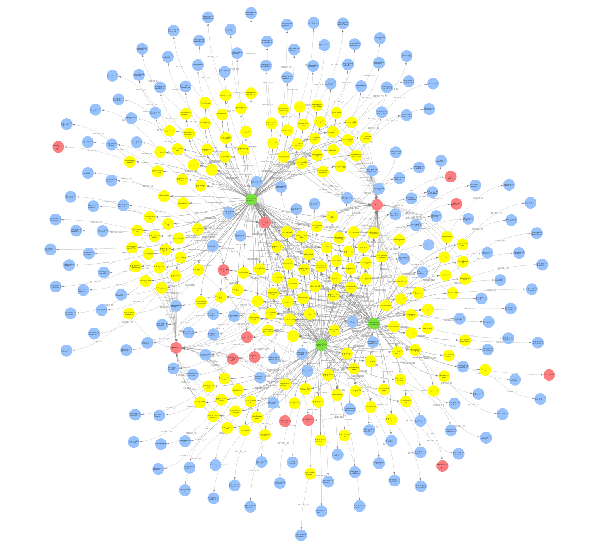
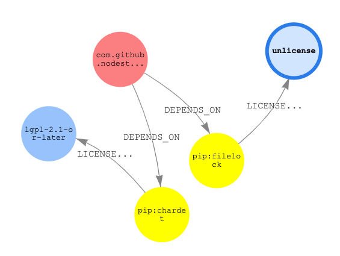

# Software Vulnerability Analysis using SBOMs, Amazon Neptune, and Nodestream

**Note**: Both the Nodestream Neptune and Nodestream SBOM plugins are currently preview releases

Recently, (March 2024) [a severe vulnerability was found to have been added to a common library, XZ utility](https://www.cisecurity.org/advisory/a-vulnerability-in-xz-utils-could-allow-for-remote-code-execution_2024-033). Unfortunately, serious software vulnerabilities are not isolated incidents, as in late 2021, a [critical security vulnerability was discovered in a commonly used logging library, Log4j](https://www.ncsc.gov.uk/information/log4j-vulnerability-what-everyone-needs-to-know). While the origin of the issues differ, Log4j was an oversight while XZ was an explicit backdoor, the outcome for users was the end same. Once each vulnerability was known, companies and individuals spent many hours combing through countless applications, looking for and patching systems running vulnerable versions of the software.

As this effort was ongoing, many were asking, "Isn't there a better way to track this information?"

In this post, we will discuss the work we have been doing around creating a plugin for Nodestream that provides a unified graph model for SBOMs ingestion and analysis. We will combine this with the plugin for Amazon Neptune to demonstrate how you can find insights for software vulnerabilities in application stacks. Let’s first talk a bit about what an SBOM is and why you should use a graph for analysis.

## What is a Software Bill of Materials (SBOM) and why use Graphs

A software bill of materials (SBOM) is a critical component of software development and management, helping organizations to improve the transparency, security, and reliability of their software applications. An SBOM acts as an "ingredient list" of libraries and components of a software application that:

- Enables software creators to track dependencies within their applications
- Provides security personnel the ability to examine and assess the risk of potential vulnerabilities within an environment
- Provides legal personnel with the information needed to assure that a particular software is in compliance with all licensing requirements.

A software bill of materials (SBOM) is a comprehensive list of the components, libraries, and dependencies used in a software application or system. It provides a detailed breakdown of the software's architecture, including the names, versions, licenses, and optionally the vulnerabilities of each component and describes the complex dependencies and relationships between components of a software system, including multi-level hierarchies and recursive relationships.

Graphs are excellent for modeling these kinds of interconnected relationships, with nodes representing components and edges representing dependencies and relationships between these components. Graph data structures handle recursive relationships very naturally, making it easy to analyze networks and flows. Using graph algorithms and metrics, allows you to analyze and identify critical components and dependencies, single points of failure, security vulnerabilities, license compatibilities, etc. for use cases such as:

- Dependency graphs - These show how different components in the software relate to and depend on each other. Graphs make these complex relationships easier to visualize.
- Vulnerability Graphs - Graphs make it easy to determine and assign associated risks with different vulnerabilities to prioritize fixing known issues.
- Supply chain graphs - SBOMs trace the components and dependencies up the software supply chain. Graphs can illustrate the flow of open-source components from lower-level suppliers up to the final product. This helps identify vulnerabilities or licensing issues in the supply chain.

## How to use Graphs for SBOM analysis

While using graphs to assist with SBOM analysis is not new, it also has not been trivial to get the data loaded in due to differing formats, with the two most popular being [CycloneDX](https://cyclonedx.org/) and [SPDX](https://spdx.dev/). To assist with the data loading and analysis, I recently worked on an [SBOM plugin](https://github.com/nodestream-proj/nodestream-plugin-sbom/tree/main) for [Nodestream](https://nodestream-proj.github.io/docs/docs/intro/) to provide a simple way to load SBOMs into an opinionated graph data model from local files, GitHub, or Amazon Inspector. [Nodestream](https://nodestream-proj.github.io/docs/docs/intro/) is a Python framework for performing graph database ETL. The SBOM plugin extends this framework to provide a

### Loading Data into SBOMs into our Graph

To get started loading your SBOM files into Amazon Neptune, we first need to setup an Amazon Neptune Analytics Graph as well as a Neptune Notebook to perform our analysis. To configure a Neptune Analytics Graph you can follow the documentation here: https://docs.aws.amazon.com/neptune-analytics/latest/userguide/create-graph-using-console.html

Neptune Notebooks is a managed open-source graph-notebook project provides a plethora of Jupyter extensions and sample notebooks that make it easy to interact with and learn to use a Neptune Analytics graph. This can be configured using the documentation here: https://docs.aws.amazon.com/neptune-analytics/latest/userguide/notebooks.html

Now that we have setup our database and analysis environment we next need to install the Nodestream plugins for Neptune and SBOM.

`pip install -q pyyaml nodestream-plugin-neptune nodestream-plugin-sbom`

With those data files installed, all we need to do is set our configuration in the `nodestream.yaml` file as shown below. In this example, we are going to load the SBOM files for Nodestream, the Nodestream Neptune Plugin, and the Nodestream SBOM plugin into our database, directly from GitHub.

```
plugins:
- name: sbom
  config:
    repos:[nodestream-proj/nodestream, nodestream-proj/nodestream-plugin-sbom, nodestream-proj/nodestream-plugin-neptune]
targets:
  my-neptune:
    database: neptune
    graph_id: g-<GRAPH ID>
    mode: analytics
```

With our configuration setup, we can run the import using the following command:

`nodestream run sbom_github --target my-neptune`

After we run the data load, we get a graph that similar to the image below.



### What does our graph look like?

Let’s take a look at the types of data that we are storing in our graph. The plugin uses the opinionated graph data model shown below to represent SBOM data files.

This model contains the following elements:

**Node Types**

- `Document` - This represents the SBOM document as well as the metadata associated with that SBOM.
- `Component` - This represents a specific component of a software system.
- `Reference` - This represents a reference to any external system which the system wanted to include as a reference. This can range from package managers, URLs to external websites, etc.
- `Vulnerability` - This represents a specific known vulnerability for a component.
- `License` - The license for the component or package.

**Edge Types**

- `DESCRIBES`/`DEPENDS_ON`/`DEPENDENCY_OF`/`DESCRIBED_BY`/`CONTAINS` - This represents the type of relationship between a `Document` and a `Component` in the system.
- `REFERS_TO` - This represents a reference between a `Component` and a `Reference`
- `AFFECTS` - This represents that a particular `Component` is affected by the connected `Vulnerability`

The properties associated with each element will vary depending on the input format used, and the optional information contained in each file.

## Analyzing SBOMs

Now that we have our data loaded into our graph, the next step is to start to extract insights into what is actually important in our SBOM data.

One common use case is to investigate shared dependencies across projects. Shared dependencies allow development and security teams to better understand the security posture of the organization through identification of shared risks. Let's start by taking a look at the most shared dependencies between these projects using the query below.

```
MATCH (n:Component)
WHERE exists(n.name)
CALL neptune.algo.degree(n, {traversalDirection: 'inbound', edgeLabels: ['DEPENDS_ON']})
YIELD node, degree
RETURN node.name, degree
ORDER BY degree DESC
LIMIT 10
```

Running this query will show us that there are quite a few dependencies that are shared across all three projects. To do this analysis, we used a graph algorithm known as [Degree Centrality](https://docs.aws.amazon.com/neptune-analytics/latest/userguide/degree.html) which counts the number of edges connected to a node. This measure of how connected the node is can in turn indicate the node's importance and level of influence in the network.

Running the query below shows us that there are 31 `Components` that are shared across all the projects.

```
MATCH (n:Component)
WHERE exists(n.name)
CALL neptune.algo.degree(n, {traversalDirection: 'inbound', edgeLabels: ['DEPENDS_ON']})
YIELD node, degree
WHERE degree=3
RETURN count(node)
```

Given that this is a closely connected group of projects, it is not a surprise that there are many shared components. Given that one of the strengths of graphs is the ability to visualize the connectedness between data, let’s take a look at how they are connected.

```
MATCH (n:Component)
WHERE exists(n.name)
CALL neptune.algo.degree(n, {traversalDirection: 'inbound', edgeLabels: ['DEPENDS_ON']})
YIELD node, degree
WHERE degree = 3
WITH node, degree
MATCH p=(node)-[]-()
RETURN p
```


Another common use case is to investigate licensing across multiple projects. This sort of investigation benefits from the connectedness across the graph by leveraging the connectedness to find how component licenses are connected to each other. Let’s take a look at what other licenses are associated with the `lgpl-2.1-or-later` licensed components.

```
MATCH p=(l:License)<-[:LICENSED_BY]-(:Component)<-[:DEPENDS_ON]-(:Document)
-[:DEPENDS_ON]->(:Component)-[:LICENSED_BY]->(l2)
WHERE l.name = 'lgpl-2.1-or-later' and l<>l2
RETURN DISTINCT l2.name
```


As we see, there are quite a few other licenses used in these projects. We can leverage the visual nature of graph results to gain some insight into how components are connected. In this case, let’s see how components with the `lgpl-2.1-or-later` are connected to components with the `unlicense`.

```
MATCH p=(l:License)←[:LICENSED_BY]-(:Component)←[:DEPENDS_ON]-(:Document)
-[:DEPENDS_ON]→(:Component)-[:LICENSED_BY]→(l2)
WHERE l.name = 'lgpl-2.1-or-later' and l<>l2
RETURN DISTINCT l2.name
```



We see that there exists one path in our graph between these two licenses.

## Next Steps

As we have seen, using graphs to perform analysis of SBOM data can be a powerful tool in your toolbox to gain insights into the connections between software projects. What I have shown here is only the beginning of the types of analysis you can perform with this data. For a more detailed walkthrough of using graphs for SBOM analysis, I recommend taking a look at the following notebooks:

[SBOM Dependency Analysis](https://github.com/aws/graph-notebook/blob/ISSUE-558/src/graph_notebook/notebooks/02-Neptune-Analytics/03-Sample-Use-Cases/03-Software-Bill-Of-Materials/01-SBOM-Dependency-Analysis.ipynb)
[SBOM Vulnerability Analysis](https://github.com/aws/graph-notebook/blob/ISSUE-558/src/graph_notebook/notebooks/02-Neptune-Analytics/03-Sample-Use-Cases/03-Software-Bill-Of-Materials/02-SBOM-Vulnerability-Analysis.ipynb)
