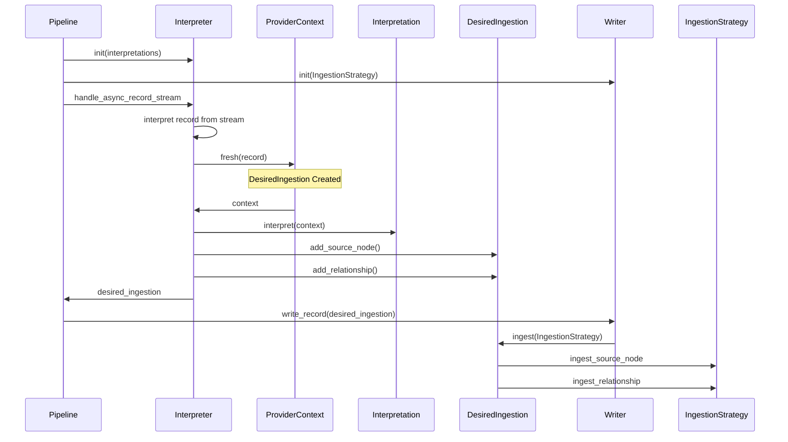

# Interpretations

# Sequence Diagram
In the diagram some details are skipped to keep the picture clean.
`Pipeline` is an abstraction for all the things happening before Interpreter step. Similarly `Writer` is included
to show where the product of interpretation is consumed. Read the narrative for 
additional details.

Narrative for the above diagram:
1. When a pipeline with `Interpreter` step starts up, it initializes `Interpreter` with interpretations from the pipeline YAML file
2. It also adds the `Writer` step based on targets specified in nodestream.yaml
3. `Interpreter` will handle a record stream from the pipeline and start interpreting each record
4. It starts out by creating a context with a blank `DesiredIngestion`
5. It then feeds the `DesiredIngestion` into every interpretation specified in the pipeline YAML file.
6. The most common interpretation is the `SourceNodeInterpretation`, and it adds a source `Node` to the `DesiredIngestion`
7. A `RelationshipInterpretation` adds a `RelationshipWithNodes` to the `DesiredIngestion`
8. The Interpreter then yields the DesiredIngestion to the pipeline.
9. At the end of the pipeline the `Writer` step processes the `DesiredIngestion` using the configured `IngestionStrategy`