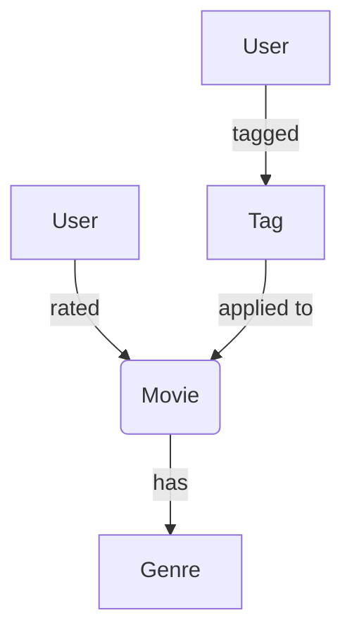

# MovieLens Recomendation Engine 

## Introduction

The MovieLens data set is a classic data set used for recommendation systems. 
It contains a set of ratings given by a set of users to a set of movies. 
The data set is available in different sizes, and we will use the smallest one, which contains 100,000 ratings.

## Data

The data is available [here](https://grouplens.org/datasets/movielens/100k/) as a zip file.
When you unzip it, you will find 3 csv files: `ratings.csv`, `movies.csv`, and `tags.csv`.
We'll ingest all three of these files into our graph.

### `ratings.csv`

The `ratings.csv` file contains the following columns:

- `userId`: the id of the user who rated the movie (an integer)
- `movieId`: the id of the movie that was rated (an integer)
- `rating`: the rating given by the user (a float)
- `timestamp`: the time when the rating was given (an integer)

### `movies.csv`

The `movies.csv` file contains the following columns:

- `movieId`: the id of the movie (an integer)
- `title`: the title of the movie (a string)
- `genres`: the genres of the movie (a string), separated by `|`

### `tags.csv`

The `tags.csv` file contains the following columns:

- `userId`: the id of the user who tagged the movie (an integer)
- `movieId`: the id of the movie that was tagged (an integer)
- `tag`: the tag given by the user (a string)
- `timestamp`: the time when the tag was given (an integer)


## Getting Started

First, we need to create a new nodestream project:

```bash
nodestream new movies
nodestream remove default sample # remove the default sample pipeline
```

Then, we'll copy the data files into a newly `data` directory of our project.

```bash
mkdir -p movies/data
cp path/to/ratings.csv path/to/movies.csv path/to/tags.csv movies/data
```

Now we can cd into the project and scaffold the pipelines for each file:

```bash
cd movies
nodestream scaffold ratings
nodestream scaffold movies
nodestream scaffold tags
```

This will create a new pipeline for each file, and we can now edit the `ratings` pipeline to ingest the `ratings.csv` file.
Before continuing, be sure to configure your database connection in the `nodestream.yaml` file.
See the [Databases](../../category/database-support) section for more information.


## Building the Piplines 

In this example, we'll build a graph with the following schema:



### Ratings

We'll start by editing the `ratings` pipeline to ingest the `ratings.csv` file.
Open the `pipelines/ratings.yaml` file and delete the default content. 
Then, add the following content:

```yaml
- implementation: nodestream.pipeline.extractors:FileExtractor
  arguments:
    globs:
      - data/ratings.csv
```

This will tell the pipeline to extract the data from the `ratings.csv` file.
However, this does not tell the pipeline how to ingest the data into the graph.
We'll need to add a new step to the pipeline to do that.

```yaml
# ... previous content

- implementation: nodestream.interpreting:Interpreter
  arguments:
    interpretations:
      - type: source_node
        node_type: User
        key:
          id: !jmespath userId
      - type: relationship
        relationship_type: RATED
        node_type: Movie
        node_key:
          id: !jmespath movieId
        relationship_properties:
          rating: !jmespath rating
          at: !jmespath timestamp
```

This will tell the pipeline to interpret the data and create the `User` and `Movie` nodes, and the `RATED` relationships between them.
The `!jmespath` expressions are used to extract the data from the csv file. 
In this case, we are extracting the `userId`, `movieId`, `rating`, and `timestamp` columns.

Now, that we have the `ratings` pipeline ready, we can generate the migrations and run the pipeline:

```bash
nodestream migrations make
nodestream migrations run -t my-db
nodestream run movies -t my-db
```

### Movies

We'll do the same for the `movies` pipeline.
Open the `pipelines/movies.yaml` file and delete the default content. 
Then, add the following content:

```yaml
- implementation: nodestream.pipeline.extractors:FileExtractor
  arguments:
    globs:
      - data/movies.csv
```

This will tell the pipeline to extract the data from the `movies.csv` file.
We'll need to add a new step to the pipeline to ingest the data into the graph.

```yaml
# ... previous content

- implementation: nodestream.interpreting:Interpreter
  arguments:
    interpretations:
      - type: source_node
        node_type: Movie
        key:
          id: !jmespath movieId
        properties:
          title: !jmespath title
      - type: relationship
        relationship_type: HAS_GENRE
        node_type: Genre
        find_many: true
        node_key:
          id: !split 
            data: !jmespath genres
            delimiter: '|'
```

This will tell the pipeline to interpret the data and create the `Movie` nodes.
The `!jmespath` expressions are used to extract the data from the csv file.
Now, that we have the `movies` pipeline ready, we can generate the migrations and run the pipeline:

```bash
nodestream migrations make
nodestream migrations run -t my-db
nodestream run movies -t my-db
```

### Tags

We'll do the same for the `tags` pipeline.
Open the `pipelines/tags.yaml` file and delete the default content. 
Then, add the following content:

```yaml
- implementation: nodestream.pipeline.extractors:FileExtractor
  argumenets:
    globs:
      - data/tags.csv
```

This will tell the pipeline to extract the data from the `tags.csv` file.
We'll need to add a new step to the pipeline to ingest the data into the graph.

```yaml
# ... previous content

- implementation: nodestream.interpreting:Interpreter
  arguments:
    interpretations:
      - type: source_node
        node_type: Tag
        key:
          value: !jmespath tag
      - type: relationship
        relationship_type: TAGGED
        node_type: User
        node_key:
          id: !jmespath userId
        relationship_properties:
          at: !jmespath timestamp
        outbound: false
      - type: relationship
        relationship_type: APPLIED_TO
        node_type: Movie
        node_key:
          id: !jmespath movieId
```

This will tell the pipeline to interpret the data and create the `Tag` nodes, and the `TAGGED` and `APPLIED_TO` relationships between them.
The `!jmespath` expressions are used to extract the data from the csv file.
Now, that we have the `tags` pipeline ready, we can generate the migrations and run the pipeline:

```bash
nodestream migrations make
nodestream migrations run -t my-db
nodestream run movies -t my-db
```

## Verifying the Data

We can now verify that the data was ingested into the graph by running some queries.
    
    ```cypher
    MATCH (u:User)-[r:RATED]->(m:Movie)
    RETURN u, r, m
    LIMIT 10
    ```

    ```cypher
    MATCH (m:Movie)-[t:TAGGED]->(t:Tag)
    RETURN m, t
    LIMIT 10
    ```

    ```cypher
    MATCH (m:Movie)
    RETURN m
    LIMIT 10
    ```

    ```cypher
    MATCH (u:User)
    RETURN u
    LIMIT 10
    ```

    ```cypher
    MATCH (t:Tag)
    RETURN t
    LIMIT 10
    ```

    ```cypher
    MATCH (g:Genre)
    RETURN g
    LIMIT 10
    ```

    ```cypher
    MATCH (u:User)-[r:RATED]->(m:Movie)-[:HAS]->(g:Genre)
    RETURN u, r, m, g
    LIMIT 10
    ```


This should return some data from the graph, showing that the data was ingested correctly.


## Conclusion

Success 🎉!

Now that we have the data ingested into the graph, we can start building recommendation algorithms.
We can use the `ratings` and `tags` data to build a collaborative filtering algorithm, and the `genres` data to build a content-based filtering algorithm.
We can also use the `movies` data to build a graph-based recommendation algorithm.

