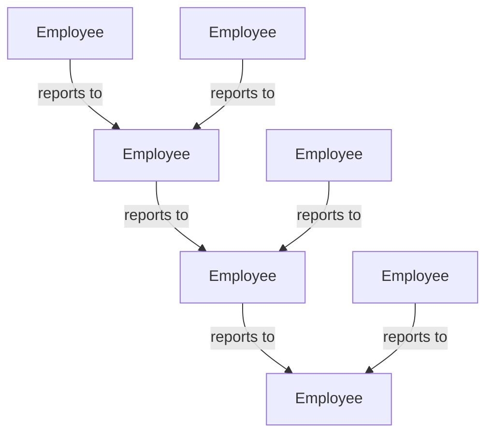

# Create A New Pipeline
Let's build an org chart with Nodestream.

In this tutorial, we'll walk you through creating a new pipeline in your Nodestream project. 


## Describing the Data Model

The first step in creating a new pipeline is to describe the data model that you want to load into your database.
Nodestream uses a simple YAML format to describe the data model - so we don't need to write any code to get started.
In this example, we're going to create an org chart for a fictional company by loading data from a CSV file.

Here's an example of what the data model might look like:



## Loading Data File

Before we can load the data into our database, we need to load the data from a file and interpret it into nodes and relationships.
In this example, we're going to load the data from a CSV file that looks like this:

```csv
employee_id,employee_name,manager_id
1,Alice,
2,Bob,1
3,Charlie,1
4,David,2
5,Eve,2
6,Frank,3
7,Grace,3
```

Copy the data into a file called `employees.csv` in a newly created `data` directory of your project.

Now, open the `pipelines/org-chart.yaml` file in your project that you created in the previous step.
As a reminder, the file should look like this:

```yaml
- arguments:
    stop: 100000
  factory: range
  implementation: nodestream.pipeline:IterableExtractor
- arguments:
    interpretations:
    - key:
        number: !jmespath 'index'
      node_type: Number
      type: source_node
  implementation: nodestream.interpreting:Interpreter
```

Every pipeline is a list of steps that describe how to load the data into your database.
The first section in the pipeline is to extract the data from the file.

```yaml
- arguments:
    stop: 100000
  factory: range
  implementation: nodestream.pipeline:IterableExtractor
```

The second section is to interpret the data into nodes and relationships.

```yaml
- arguments:
    interpretations:
    - key:
        number: !jmespath 'index'
      node_type: Number
      type: source_node
  implementation: nodestream.interpreting:Interpreter
```

For now, leave the second section as it is and replace the first section with the following:

```yaml
- implementation: nodestream.pipeline.extractors:FileExtractor
  factory: local
  arguments:
    globs:
      - data/*.csv
```

This step uses the `FileExtractor` to load the data from the `data` directory in your project.
Speicifically, nodestream is initializing the `FileExtractor` class in the `nodestream.pipeline.extractors` module.
The `FileExtractor` expects a list of glob strings passed as an argument in the `arugments` section representing the files to load.
Every file that matches these glob strings is loaded and its contents are passed to the next step in the pipeline.
CSV files are supported by default and yield each row of the csv file as a dictionary to the next step in the pipeline.

<!---
TODO: Make these links to the appropriate sections in the documentation
-->

:::note 

You are NOT limited to CSV files. Nodestream has many extractors that can load data from a variety of sources. Read more about [extractors](../../reference/extractors) in the documentation. 

:::

## Interpteting Data Into Nodes and Relationships

The next step in the pipeline is to interpret the data into nodes and relationships.
In this example, we want to interpret the data into `Employee` nodes and `reports to` relationships.
To do this, we need to update the second section in the pipeline to look like this:

```yaml
- implementation: nodestream.interpreting:Interpreter
  arguments:
    interpretations:
    - type: source_node
      key:
        employee_id: !jmespath 'employee_id'
      properties:
        name: !jmespath 'employee_name'
      node_type: Employee
    - type: relationship
      node_type: Employee
      relationship_type: REPORTS_TO
      node_key:
        employee_id: !jmespath 'manager_id'
```

The next section you will spend the most time with is the `Interpreter` step.
The `Interpreter` step is responsible for interpreting the data into nodes and relationships.
The `Interpreter` step expects a list of interpretations passed as an argument in the `arguments` section.
Each interpretation is a dictionary that describes how to interpret the data into nodes and relationships.
In the following example, we will explain the two interpretations from when we updated the second section.

### Source Node Interpretation
The following section is the first interpretation, which is a `source_node` interpretation.
It describes how to interpret the data into `Employee` nodes.

```yaml
- type: source_node
  key:
    employee_id: !jmespath 'employee_id'
  properties:
    name: !jmespath 'employee_name'
  node_type: Employee
```

A source node represents the node at the conceptual "center" of the ingest. 
Typically, this represents the central entity that you are modeling with the ingest. 
In our case, it's the employee for whom the record represents. 
We've decided to call this type of node an `Employee`.

The `key` block tells nodestream what set of properties represents a unique node of the `node_type` and how to get the values. 
In our case, we use the employee_id field the record and extract that using the !jmespath Value Provider.

We take a similar approach with the properties field. We extract the `name` property.
Note that we have kept the field names on the node the same as the CSV document, but this does not need to be the case.

See Also: [Reference documentation for source node interpretation](../reference/interpreting.md#source-node-interpretation)

### Relationship Interpretation

A graph database would be a lot less useful if we did not create relationships to other data. 
In our case, we want to model the org chart, so the following section draws the relationship to the employee's boss.

```yaml
- type: relationship
  node_type: Employee
  relationship_type: REPORTS_TO
  node_key:
    employee_id: !jmespath 'manager_id'
```

Here we tell the interpreter that we want to relate to an `Employee` to our source node with a relationship type of `REPORTS_TO`. 
For nodestream to know which `Employee` node to relate to, we need to specify the key of the related node. 
In our case, we can do that by extracting the value of `manager_id` and mapping it to the `employee_id` key of the related node.

See Also: [Reference documentation for relationship interpretation](../reference/interpreting.md#relationship-interpretation)


## Next Steps

Now that you've created a new pipeline, you can [prepare your database](./prepare-your-database.mdx) to load the data into your database.
