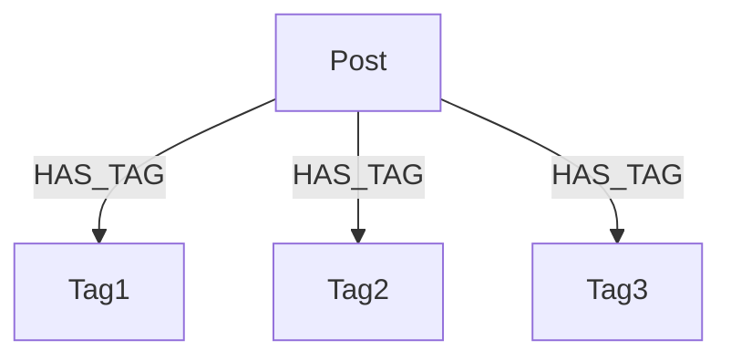

# Data Massaging

How to massage input data into records that you want to interpret.

## Introduction

In previous sections, you learned how to interpret simple data into nodes and relationships.
Unfortunately, input data is rarely in the exact format that you need.
In this section, you will learn how to massage input data and process it such that it can easily be interpreted into nodes and relationships.

## Normalization Flags

Normalization flags are a way to tell a given intepretation to normalize a scalar value before interpreting it. For example, you might want to normalize a string to lowercase before using it as a node key. Flags are specified in the various intepretation clauses such as `source_node` and `relationship`.

### Normalizing in the `source_node` Interpretation

The `source_node` interpretation has a block to specify normalization flags:

```yaml
- type: source_node
  node_type: Person
  key:
    first_name: !jmespath name
    last_name: !jmespath surname
  normalization:
    do_trim_whitespace: true
```

This example will trim whitespace from a string before storing the value were defined.
By default, the `do_lowercase_strings` flag is set to `true` unless explicitly disabled.
If you want to disable this, you can set it to `false`:

```yaml
- type: source_node
  node_type: Person
  key:
    first_name: !jmespath name
    last_name: !jmespath surname
  normalization:
    do_lowercase_strings: false
```

Of course, you may also combine a series of flags together.
The order of normalization flags is not guaranteed, so be careful when combining flags that depend on the order of operations.
If that is the case, you may want to use a transformer to normalize the data before interpreting it.
See [Creating Custom Transformers](../../tutorials-advanced/new-steps#creating-a-transformer) for more information.

```yaml
- type: source_node
  node_type: Person
  key:
    first_name: !jmespath name
    last_name: !jmespath surname
  normalization:
    do_lowercase_strings: false
    do_trim_whitespace: true
```

If you want to apply different normalization rules to keys than you do to properties, it is recommended you use a properties interpretation
after the source node interpretation to apply the different normalization rules. For example:

```yaml
- type: source_node
  node_type: Person
  key:
    first_name: !jmespath name
    last_name: !jmespath surname
  normalization:
    do_trim_whitespace: true
- type: properties
  properties:
    status: !jmespath status
  normalization:
    do_lowercase_strings: true
```

This example will trim whitespace from the `first_name` and `last_name` keys, and lowercase the `status` property.


### Normalizing in the `relationship` Interpretation

The `relationship` interpretation allows for two different sets of normalization flags: one for the key and one for the properties.

```yaml
- type: relationship
  relationship_type: IS_MEMBER_OF
  node_type: Organization
  node_key:
    name: !jmespath organization.name
  node_properties:
    tax_id_number: !jmespath organization.tax_id_number
  relationship_key:
    role: !jmespath role
  relationship_properties:
    start_date: !jmespath start_date
  key_normalization:
    do_lowercase_strings: true
  property_normalization:
    do_trim_whitespace: true
```

The key normalization flags will be applied to both the `node_key` and `relationship_key` clauses, while the property normalization flags will be applied to both the `node_properties` and `relationship_properties` clauses.
Currently, there is no way to apply different normalization rules to the `node_key` and `relationship_key` clauses, or to the `node_properties` and `relationship_properties` clauses globally. However, you can use [`!normalize`](#normalzing-values-inline) to apply different normalization rules inline. For example:

```yaml
- type: relationship
  relationship_type: IS_MEMBER_OF
  node_type: Organization
  node_key:
    name: !normalize
      using: trim_whitespace
      data: !jmespath organization.name
  node_properties:
    tax_id_number: !jmespath organization.tax_id_number
  relationship_key:
    role: !jmespath role
  relationship_properties:
    start_date: !jmespath start_date
  key_normalization:
    do_lowercase_strings: true
  property_normalization:
    do_trim_whitespace: true
```

### Normalzing Values inline

Nodestream has the yaml tag `!normalize` that can be used to normalize a value inline:

```yaml
- type: source_node
  node_type: !normalize "Person"
  key:
    first_name: !normalize
      using: trim_whitespace
      data: !jmespath name
    last_name: !jmespath surname
```

This allows you to normalize values inline without having to use the `key_normalization` and `property_normalization` flags, which apply to all values in a given clause.

## Interpreter Tricks

The `Interpreter` class has a few tricks up its sleeve to handle some common data massaging tasks without additional transformers and other processing steps.

### Handling Nested Data Structures

The `iterate_on` and `before_iteration` clauses are used to handle nested data structures that need to be iterated over while interpreting.
Essentially, the `iterate_on` clause is used to specify a JMESPath expression that will return a list of records to be iterated over from the input data.
The `before_iteration` clause is used to specify a set of interpretations that should be applied to each record before the `iterate_on` is applied.

For example, consider the following input data:

```json
{
  "organization": {
    "name": "Acme Inc."
  },
  "people": [
    {
      "name": "John",
      "surname": "Doe",
      "age": 30,
      "contact": {
        "email": "jdoe@example.com",
        "phone": "555-555-5555"
    },
    {
      "name": "Jane",
      "surname": "Doe",
      "age": 28,
      "contact": {
        "email": "jane_doe@example.com",
        "phone": "555-555-5555"
    }
  ]
}
```

You can use the `iterate_on` and `before_iteration` clauses to interpret the `people` array as a set of `Person` nodes and `IS_MEMBER_OF` relationships to the `Organization` node while also interpreting the `contact` object as a set of `Contact` nodes and `HAS_CONTACT` relationships to the `Person` node.

```yaml
- implementation: nodestream.interpreting:Interpreter
  arguments:
    before_iteration:
      - type: relationship
        relationship_type: IS_MEMBER_OF
        node_type: Organization
        node_key:
          name: !jmespath organization.name
    iterate_on: !jmespath people
    interpretations:
      - type: source_node
        node_type: Person
        key:
          first_name: !jmespath name
          last_name: !jmespath surname
      - type: relationship
        relationship_type: HAS_CONTACT
        node_type: Email
        node_key:
          email: !jmespath contact.email
      - type: relationship
        relationship_type: HAS_CONTACT
        node_type: Phone
        node_key:
          phone: !jmespath contact.phone
```

Note, the `before_iteration` clause is defined relative to the whole input record. The `iterate_on` clause is also defined relative to the whole input record but sets the scope for the `interpretations` clause. This means that the `before_iteration` clause is applied to the whole input record, while the `interpretations` clause is applied to each record in the `people` array. Conceptually, the interpreter executes this pseudocode:

```python
# original_input_record is the input data

for sub_item in original_input_record.break_down_from_jmespath(iterate_on_clause):
    for interpretation in before_iteration:
        interpretation.execute(original_input_record)
    for interpretation in interpretations:
        interpretation.execute(sub_item)
```

### Ingesting Deeper Relationship Hierarchies

Imagine you have a data structure that is deeper with three hops.
For example, you have a `Person` node that has a `HAS_CONTACT` relationship to a `Contact` node, which has a `HAS_ADDRESS` relationship to an `Address` node. For example:

```json
{
  "name": "John",
  "surname": "Doe",
  "contact": {
    "email": "jdoe@example.com"
  }
}
```

### Variables

Variables have to uses inside of nodestream:

- Like a programming language, use them to refer to the same value in multiple places.
- Use them to save a value in `before_iteration` and use it in `interpretations`.

For example, consider the following input data:

```json
{
  "organization": {
    "name": "Acme Inc."
  },
  "people": [
    {
      "name": "John",
      "surname": "Doe",
      "age": 30,
    }
  ]
}
```

You can use a variable to refer to the `organization.name` value in multiple places. For example:

```yaml
- implementation: nodestream.interpreting:Interpreter
  arguments:
    before_iteration:
      - type: variables
        variables:
          organization_name: !jmespath organization.name
    iterate_on: !jmespath people
    interpretations:
      - type: source_node
        node_type: Person
        key:
          first_name: !jmespath name
          last_name: !jmespath surname
      - type: relationship
        relationship_type: IS_MEMBER_OF
        node_type: Organization
        node_key:
          name: !variable organization_name
```

## Projecting Data with the `ValueProjection` Transformer

The `ValueProjection` transformer is used to project a value from the input into one or more output values.
This is useful for unwinding a list of values into multple records, or for extracting a value from a nested data structure.

For example, consider the following input data:

```json
{
  "organization": {
    "name": "Acme Inc."
  },
  "people": [
    {
      "name": "John",
      "surname": "Doe",
      "age": 30
    },
    {
      "name": "Jane",
      "surname": "Doe",
      "age": 30
    }
  ]
}
```

But we'd rather have the data look like this:

```json
{
  "members": [
    {
      "name": "John",
      "surname": "Doe",
      "age": 30
    },
    {
      "name": "Jane",
      "surname": "Doe",
      "age": 30
    }
  ],
  "org_name": "Acme Inc."
}
```

You can use the `ValueProjection` transformer to project the `organization.name` value into the `org_name` field and the `people` array into the `members` field. For example:

```yaml
- implementation: nodestream.pipeline.transformers:ValueProjection
  arguments:
    projection: !jmespath "{org_name: organization.name, members: people[*]}"
```

This is also commonly used for unwding arrays.
For example, consider the following input data:

```json
{
  "organization": {
    "name": "Acme Inc."
  },
  "people": [
    {
      "name": "John",
      "surname": "Doe",
      "age": 30
    },
    {
      "name": "Jane",
      "surname": "Doe",
      "age": 30
    }
  ]
}
```

But we'd rather have the data look like this:

```json
{
  "name": "John",
  "surname": "Doe",
  "age": 30,
  "organization": {
    "name": "Acme Inc."
  }
}
{
  "name": "Jane",
  "surname": "Doe",
  "age": 30,
  "organization": {
    "name": "Acme Inc."
  }
}
```

You can use the `ValueProjection` transformer to unwind the `people` array into multiple records and inject the `organization` object into each record. For example:


```yaml
- implementation: nodestream.pipeline.transformers:ValueProjection
  arguments:
    projection: !jmespath "people[*]"
    additional_values:
      organization: !jmespath "organization"
```

## Working with Strings

Everyone loves working with strings, right? Here are some common string operations you might need to perform.

### Concatenation and Formatting

Nodestream supports string concatentation and formatting by with `!format`.
For example, if you wanted to create a hello world node based on a name field in the record, you could do the following:

```yaml
- implementation: nodestream.interpreting:Interpreter
  arguments:
    interpretations:
      - type: variables
        variables:
          hello_world: !format
            fmt: "Hello, {name}!"
            name: !jmespath name
      - type: source_node
        node_type: HelloWorld
        key:
          message: !variable hello_world
```

Note, while you can use `!format` anywhere you might expect, its often a bit more readable to use it in the `variables` section.

### Splitting Strings

You can split a string into multiple values using the `!split` function.
For example, if you wanted to split a comma-separated list of tags into an array like this:

```json
{
  "post_id": "123",
  "tags": "tag1,tag2,tag3"
}
```

You can use the `!split` function to split the `tags` string into an array. For example:

```yaml
- implementation: nodestream.interpreting:Interpreter
  arguments:
    interpretations:
      - type: source_node
        node_type: Post
        key:
          id: !jmespath post_id
      - type: relationship
        relationship_type: HAS_TAG
        node_type: Tag
        find_many: true
        node_key:
          name: !split
            string: !jmespath tags
            delimiter: ","
```

Which produces a graph like this:



### Extracting Values With Regular Expressions

Despte best intentions, sometimes you'll need to regex out a value from a string. `nodestream` provides a `!regex` function to help with this.

For example, consider the following input data:

```json
{
  "post_id": "p-123"
  "title": "Post 123: Hello, World!"
}
```

You can use the `!regex` function to extract the post number from the `title` string. For example:

```yaml
- implementation: nodestream.interpreting:Interpreter
  arguments:
    interpretations:
      - type: source_node
        node_type: Post
        key:
          id: !jmespath post_id
      - type: variables
        variables:
          post_number: !regex
            string: !jmespath title
            pattern: "Post ([0-9]+):"
      - type: relationship
        relationship_type: HAS_SEQUENCE_NUMBER
        node_type: SequenceNumber
        find_many: true
        node_key:
          name: !variable post_number
```

By default, the value will be the result of the first capture group in the regular expression.
If you want to use a different capture group, you can specify the `group` argument, which can be an integer for the capture group index or a string for the capture group name.

For example, you could rewrite our previous example to use a named capture group like this:

```yaml
- implementation: nodestream.interpreting:Interpreter
  arguments:
    interpretations:
      - type: source_node
        node_type: Post
        key:
          id: !jmespath post_id
      - type: variables
        variables:
          post_number: !regex
            string: !jmespath title
            pattern: "Post (?<number>[0-9]+):"
            group: "number"
      - type: relationship
        relationship_type: HAS_SEQUENCE_NUMBER
        node_type: SequenceNumber
        find_many: true
        node_key:
          name: !variable post_number
```
