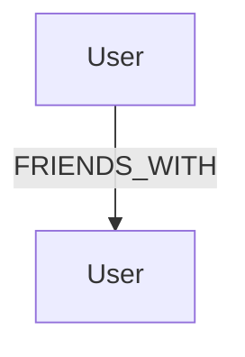
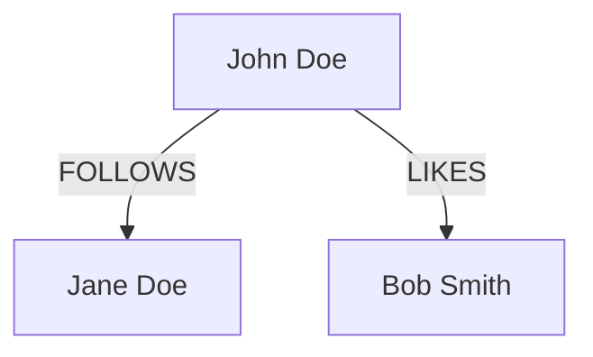
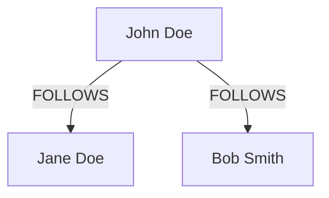
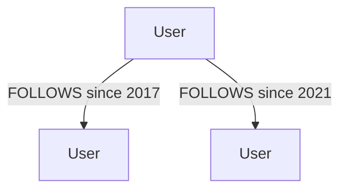
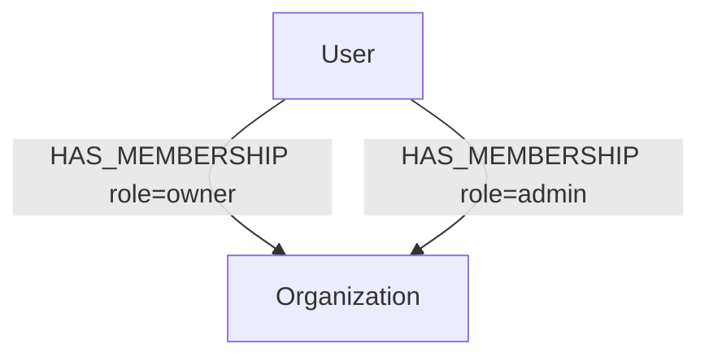
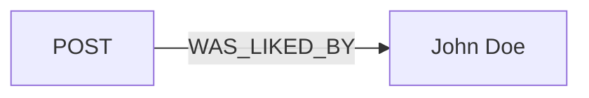
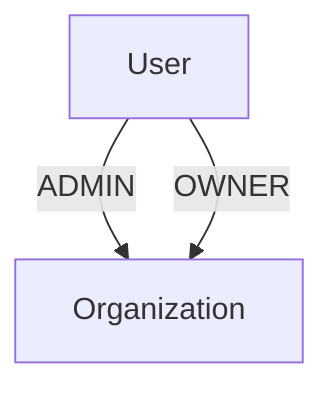

# Relationship Building
Technical documentation that may be misconstrued as life advice.

## Introduction
This tutorial covers advanced techniques for working with the `relationship` interpretation in `nodestream`.

The `nodestream` Interpreter works off the concept of the [Source Node](../source-nodes).
This is the node that is conceptually at the center of the data being ingested.
Since a relationship is defined in terms of the two nodes it connects, all we need to do after we have defined our source node is to define the other node that the source node is connected to.

## Basic Relationship Building

Relationships are defined in the pipeline using the `relationship` interpretation.
The `relationship` interpretation is used to connect the source node to another node in the graph.

Imagine we are building a social network graph and are processing data about users and their friends.
We might have a source node that represents a user and a relationship that represents the user's friend that connects to another user node like so:



Presuming that the raw data looks like this:

```json
{
  "user": "John Doe",
  "friend": "Jane Doe"
}
```

We would define our interpretations like this:

```yaml
# Future code examples will omit the source node for brevity
- type: source_node
  node_type: User
  node_key:
    name: !jmespath user
- type: relationship
  node_type: User
  relationship_type: FRIENDS_WITH
  node_key:
    name: !jmespath friend
```

This is a simple example, but it demonstrates the basic concept of connecting nodes in a graph.

:::note

The `relationship` interpretation is used to connect the source node to another node in the graph.
By default, the `relationship` interpretation will create the related node if it does not already exist.
If the related node already exists, the `relationship` interpretation will connect the source node to the existing node and update the node's properties.

:::

## Connecting to More Than One Node at a Time
In many cases, the source node will be connected to more than one node at a time.
There are several techniques for handling this situation.

### Multiple `relationship` Interpretations

The simplest way to handle this situation is to define multiple `relationship` interpretations in the same pipeline.
Each `relationship` interpretation will connect the source node to a different node.

For example, consider the following raw data:

```json
{
  "user": "John Doe",
  "follows": "Jane Doe",
  "likes": "Bob Smith"
}
```

We might want to model this as a graph like this:



To accomplish this, we would need to define two `relationship` interpretations in the same pipeline:

```yaml
- type: relationship
  node_type: User
  relationship_type: FOLLOWS
  node_key:
    name: !jmespath follows
- type: relationship
  node_type: User
  relationship_type: LIKES
  node_key:
    name: !jmespath likes
```

This is simple, explicit, and easy to understand.
However, it can be cumbersome if there are many relationships to define.
Still, this is **the best** approach if the relationships do not share common configuration.

### `find_many` Key

The next technique is to use the `find_many` key. This flag tells `nodestream` to interpret the provided key binding as a list of nodes, and to create a relationship to each of them. This is useful when the nodes to connecto to are all at the same level in the raw data and/or when they share the same configuration.

For example, consider the following raw data:

```json
{
  "user": "John Doe",
  "follows": [
    {
      "name": "Jane Doe"
    },
    {
      "name": "Bob Smith"
    }
  ]
}
```

We might want to model this as a graph like this:



To accomplish this, we would use the `find_many` key:

```yaml
- type: relationship
  node_type: User
  find_many: true
  node_key:
    name: !jmespath follows[*].name
```

This is a more concise and expressive way to define the relationships.
It also works when the key of the related node is multiple parts. For example, if the raw data looked like this:

```json
{
  "first_name": "John",
  "last_name": "Doe",
  "follows": [
    {
      "first_name": "Jane",
      "last_name": "Doe"
    },
    {
      "first_name": "Bob",
      "last_name": "Smith"
    }
  ]
}
```

We could still use the same `find_many` key:

```yaml
- type: relationship
  node_type: User
  find_many: true
  node_key:
    first_name: !jmespath follows[*].first_name
    last_name: !jmespath follows[*].last_name
```

This works by zipping the `first_name` and `last_name` arrays together and creating a relationship for each pair.

### `iterate_on` Key

The `iterate_on` key is similar to the `find_many` key in the sense that it allows you to connect to more than one node at a time in the same relationship interpretation. However, it is more flexible in that allows you to iterate over an arbitrary structure and bind the keys (and properties) relative to the current iteration. What the heck does that mean? Let's see an example.

Consider the data we used in the previous example:

```json
{
  "user": "John Doe",
  "follows": [
    {
      "name": "Jane Doe"
    },
    {
      "name": "Bob Smith"
    }
  ]
}
```

The equivlent interpretation using the `iterate_on` key would look like this:

```yaml
- type: relationship
  node_type: User
  iterate_on: !jmespath follows[*]
  node_key:
    name: !jmespath name
```

In this example, the benefit of using the `iterate_on` key is not immediately obvious.
However, it will be more clear when we add properties to the relationship, which we will cover in the next section.


## Adding Properties to Relationships

By default, a relationship comes with relatively few properties on it.
Many domain models require additional properties to be added to relationships.
For example, consider a social network where users can follow other users.

Given raw data like this:

```json
{
  "user": "John Doe",
  "follows": [
    {
      "name": "Jane Doe",
      "since": "2021-01-01"
    },
    {
      "name": "Bob Smith",
      "since": "2021-01-15"
    }
  ]
}
```

We might want to model this as a graph like this:



To accomplish this, we would need to add a `since` property to the relationship between the user and the user they follow.
That can be done with the following interpretation:

```yaml
- type: relationship
  node_type: User
  relationship_type: FOLLOWS
  iterate_on: !jmespath follows[*]  # Iterate over each user the user follows
  node_key:
    name: !jmespath name
  relationship_properties:
    since: !jmespath since
```

Here we use the `relationship_properties` key to map the properties we want to add to the relationship to the corresponding values in the raw data.
Note that in this example, we are using the `iterate_on` key to iterate over each user the user follows but this also works with a flat data structure. For example, if the raw data looked like this:

```json
{
  "user": "John Doe",
  "follows": "Jane Doe",
  "since": "2021-01-01"
}
```

We could use the following interpretation:

```yaml
- type: relationship
  node_type: User
  relationship_type: FOLLOWS
  node_key:
    name: !jmespath follows
  relationship_properties:
    since: !jmespath since
```

## Adding Keys to Relationships

By default, a relationship is generally defined as unique by the combination of the specific nodes it connects and the type of the relationship.
In other words, only one relationship of a given type can exist between any two nodes.

However, many data models require relationships to be unique based on some other property.
For example, take a permissions model where a user can have many roles within an organization.


Given raw data like this:

```json
{
  "name": "John Doe",
  "roles": [
    {
      "name": "owner",
      "organization": {
        "name": "Acme Corp"
      }
    },
    {
      "name": "admin",
      "organization": {
        "name": "Acme Corp"
      }
    }
  ]
}
```

We might want to model this as a graph like this:



In such a case, we would want to ensure that the user node has two relationships to the organization, one for each role.
Based on what we've learned so far, one might expect something like this to work:

```yaml
# does-not-work.yaml
- type: relationship
  node_type: Organization
  relationship_type: HAS_MEMBERSHIP
  iterate_on: !jmespath roles[*]  # Iterate over each role
  node_key:
    # Get the name of the organization; this will be used to uniquely identify the node.
    name: !jmespath organization.name
  relationship_properties:
    role: !jmespath name
```

While this _does_ work, it will _only_ create **one** relationship between the user and the organization, and it will have the properties of the last role in the list. Not what we want.

To get this to work, we can add a `relationship_key` section instead of a `relationship_properties` section to the relationship interpretation. This tells nodestream to deduplicate relationships by accounting for the defined key of the relationship in addition to the nodes its relating. This will create two relationships between the user and the organization, one for each role. :tada:

```yaml
# does-work.yaml
- type: relationship
  node_type: Organization
  relationship_type: HAS_MEMBERSHIP
  iterate_on: !jmespath roles[*] # Iterate over each role
  node_key:
    # Get the name of the organization; this will be used to uniquely identify the node.
    name: !jmespath organization.name
  relationship_key:
    # Get the name of the role; this will be used to uniquely identify the relationship.
    role: !jmespath name
```

## Adding Properties to Related Nodes

In some cases, you may want to add properties to the related nodes themselves.
For example, consider a social network where we are modeling users and liked  posts.

Given raw data like this:
```json
{
  "user": "John Doe",
  "liked_posts": [123, 456],
}
```

We might want to update our graph like this:


To accomplish this, we would need to add a `last_liked_by` property to the Post node that John Doe liked.
While you can flatten the data or flip the ingestion around so that the Post is the source node, these are not always feasible options and are indirect solutions to the problem.
Instead, you can use the `node_properties` key to add properties to the related nodes.

```yaml
- type: relationship
  node_type: User
  relationship_type: LIKED
  find_many: true
  node_key:
    id: !jmespath liked_posts[*]
  node_properties:
    last_liked_by: !jmespath user
```

## Flipping Relationship Directionality

In nodestream all relationships are directed, meaning that they have a source and a target node.
By default, relationships are directed from the source node to the target node.
However, you can change flip the direction of the relationship by setting the `outbound` key to `false`.

For example, consider our previous example with a social network where we are modeling users and liked posts.

Given raw data like this:
```json
{
  "user": "John Doe",
  "liked_posts": [123, 456],
}
```

We might want to update our graph like this:



To accomplish this, we would need to set the `outbound` key to `false` in the relationship interpretation.

```yaml
- type: relationship
  node_type: Post
  relationship_type: WAS_LIKED_BY
  find_many: true
  node_key:
    id: !jmespath liked_posts[*]
  outbound: false
```

## Preventing Related Nodes from Being Created

By default, nodestream will create nodes for related nodes if they do not already exist.
However, you can prevent this behavior by setting the `node_creation_rule` key to either `MATCH_ONLY` or `FUZZY`.

- `MATCH_ONLY` will only create a relationship if the related node already exists. If the related node does not exist, the relationship will not be created.
- `FUZZY` will treat the key properties as regular expressions and will only create a relationship to the nodes that match the regular expression. If no nodes match the regular expression, the relationship will not be created.

:::note

This is only supported for string properties and has a performance impact and should be used with caution.

:::


## Dynamic Node / Relationship Types

In some cases, you may want to dynamically set the type of the relationship based on the data. For example, recall our permissions model where a user can have many roles within an organization.

Given raw data like this:

```json
{
  "name": "John Doe",
  "roles": [
    {
      "name": "OWNER",
      "organization": {
        "name": "Acme Corp"
      }
    },
    {
      "name": "ADMIN",
      "organization": {
        "name": "Acme Corp"
      }
    }
  ]
}
```

We might want to model this as a graph like this:



To accomplish this, we can use the `relationship_type` key to dynamically set the type of the relationship based on the data as we would with any other field.

```yaml
- type: relationship
  node_type: Organization
  iterate_on: !jmespath roles[*]
  relationship_type: !jmespath name
  node_key:
    name: !jmespath organization.name
```

Similarly, you can use the `node_type` key to dynamically set the type of the related node based on the data as we would with any other field.

```yaml
- type: relationship
  node_type: !jmespath organization.name
  iterate_on: !jmespath roles[*]
  relationship_type: !jmespath name
  node_key:
    name: !jmespath organization.name
```


### Caveats

These features come with some VERY IMPORTANT caveats.
1. The relationship/node type must be a string.
2. The relationship/node type must be a valid identifier for your underlying database.
3. The data you are using to set the relationship type **MUST BE** sanitized and validated to prevent injection attacks. This is especially important if the data is coming from an untrusted source.
4. Because the relationship/node type is dynamic, it is not possible to have the interpretaions that use this feature to be pre-validated by the schema. Migrations, for example, cannot prepare the database appropriately for this data type. So manual intervention may be required to ensure that the database is properly configured to handle the data.
5. For the same reason, it is not possible for the schema system to know what the relationship/node type will be, so many of the features that rely on the schema system will not work with this feature.

**In general, it is best to avoid using this feature if at all possible**. If you find yourself needing to use this feature, it is a good idea to take a step back and consider if there is a better way to model your data.
